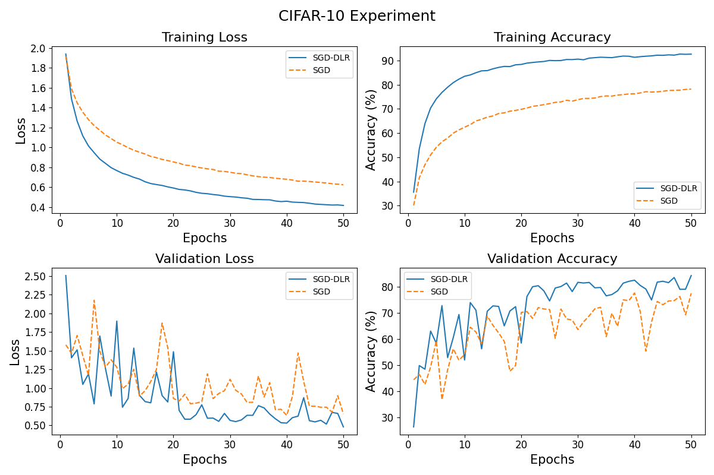
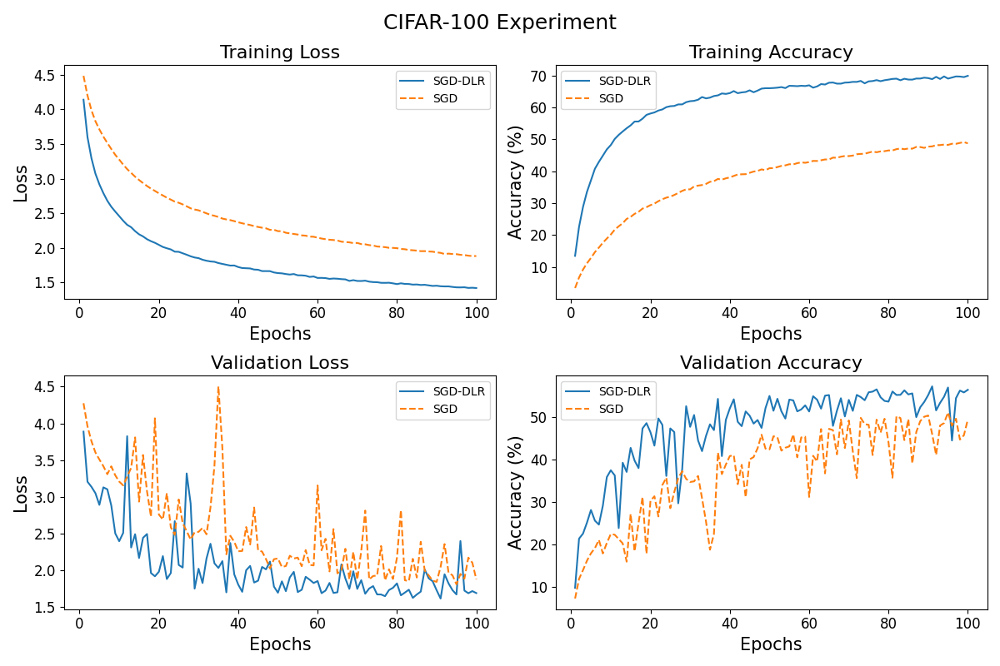

# ADC 2024 - Stability-Driven CNN Training with Lyapunov-Based Dynamic Learning Rate

This repository documents the code for the experiment for the paper _Stability-Driven CNN Training with Lyapunov-Based Dynamic Learning Rate_ for [Australasian Database Conference (ADC)](https://adc-conference.github.io/2024/) 2024

## Experiment Motivation

In the paper, _Stability-Driven CNN Training with Lyapunov-Based Dynamic Learning Rate_, we first modeled Convolutional Neural Networks (CNNs) and their training process as a dynamic system using Control Theory concepts. Then we proposed a novel approach to assess and maintain the stability of such a system by applying Lyapunov Stability Analysis. We design the experiment to examine the effectiveness of our approach in real cases.

## experiment Design

Datasets CIAFR-10 and CIFAR-100 are chosen for the experiment. We applied data augmentation techniques like random cropping and horizontal flipping on CIFAR-10 and CIFAR-100 to reduce overfitting. We constructed a CustomCNN model for this task, which includes three convolutional layers with batch normalization, ReLU activation, and max-pooling, followed by fully connected layers and a 10-unit output.

Two optimization methods were compared: basic SGD with a learning rate of 0.01 and SGD-DLR (SGD with a dynamic learning rate) with an initial rate of 0.01, control parameters $\alpha = 0.1$, $\beta = 0.1$, and learning rate bounds between $1 \times 10^{-6}$ and 0.05.

For the experiment on CIFAR-10, both models were trained for 50 epochs with a batch size of 128. For the experiment on CIFAR-100, both models were trained for 100 epochs with a batch size of 128

Training and validation loss, accuracy, and the learning rate evolution in SGD-DLR were tracked, along with Lyapunov function changes to observe stability dynamics.

## Experiment Result and Analysis

SGD-DLR showed faster convergence and improved generalization over basic SGD in both experiments. Its dynamic learning rate, guided by Lyapunov Stability Analysis, ensured stable training with smoother convergence and higher accuracy.

The experiments confirm that our control-theoretic framework for dynamically adjusting the learning rate enhances the stability and performance of CNN training. By comparing against basic SGD on the CIFAR-10 and CIFAR-100 datasets, we demonstrate the practical advantages of our approach in terms of stability, convergence speed, and generalization performance.
